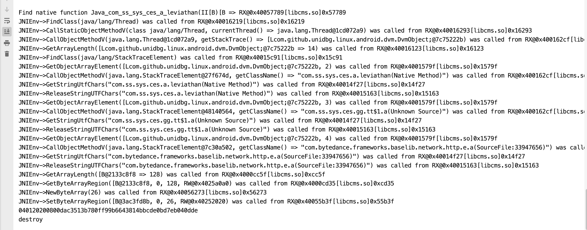

# unidbg_douyin libcms.so.10.5

本基本是参考 unicorn 和 ExAndroidNativeEmu 个人学习使用，不在更新

关于 [unicorn](https://github.com/zhkl0228/unicorn) 
关于 [ExAndroidNativeEmu](https://github.com/maiyao1988/ExAndroidNativeEmu)

IDEA中打开项目

直接Run src/test/java/com/sun/jna/JniDispatchTest32.java

 
## Thanks
- [unicorn](https://github.com/zhkl0228/unicorn)
- [AndroidNativeEmuE](https://github.com/AeonLucid/AndroidNativeEmu)
- [HookZz](https://github.com/jmpews/HookZz)
- [xHook](https://github.com/iqiyi/xHook)
- [AndroidNativeEmu](https://github.com/AeonLucid/AndroidNativeEmu)
- [usercorn](https://github.com/lunixbochs/usercorn)
- [keystone](https://github.com/keystone-engine/keystone)
- [capstone](https://github.com/aquynh/capstone)
- [idaemu](https://github.com/36hours/idaemu)
- [jelf](https://github.com/fornwall/jelf)
- [whale](https://github.com/asLody/whale)
- [kaitai_struct](https://github.com/kaitai-io/kaitai_struct)
- [fishhook](https://github.com/facebook/fishhook)

【声明:纯属android hook练习,本项目仅供技术学习交流,其它非法用途与本人无关】